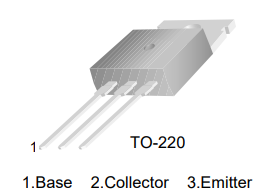
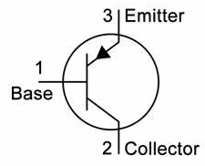
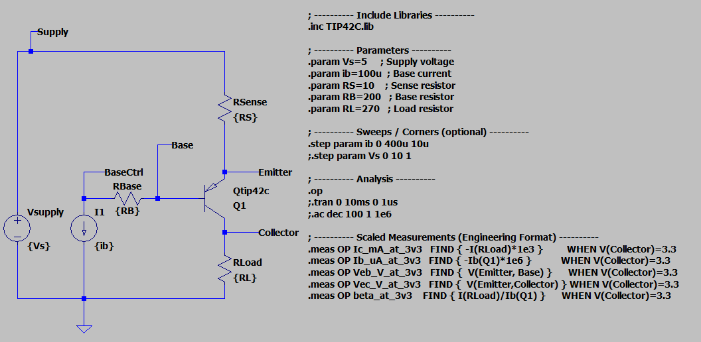
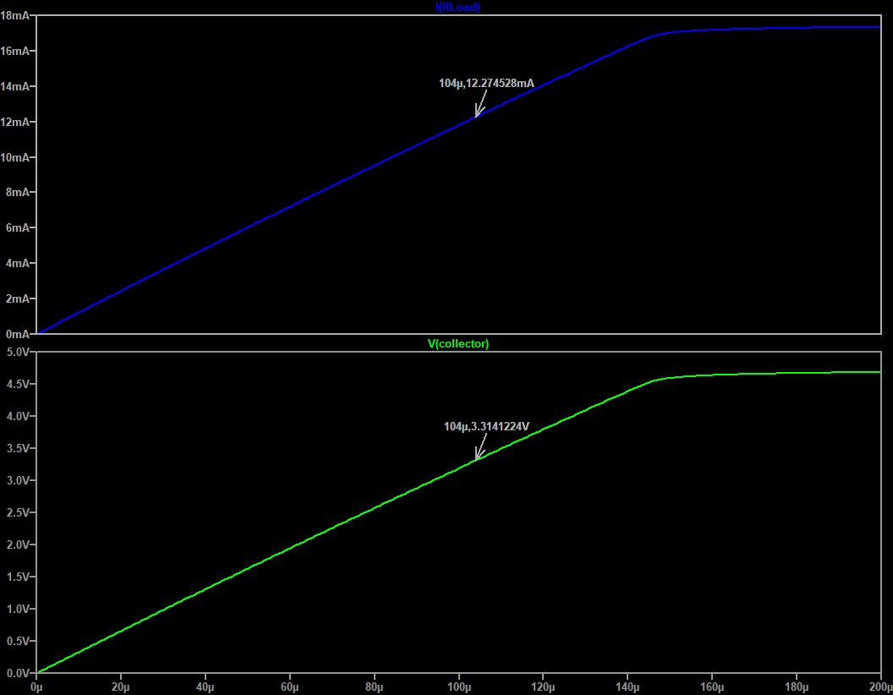

# TIP42C PNP Bipolar Junction Transistor (BJT)

## Overview
- **Objective**: Characterize the TIP42C PNP BJT for general-purpose amplification and switching applications.
- For this test we will target an output voltage of 3.3 V at the collector with a load of 270 Ω, driven by a base current up to 400 µA. But other configurations can be tested as needed.
- 
---

## Component(s) Used

| Component | Part Number | Package | Datasheet | Manufacturer |
|-----------|--------------|---------|-----------|--------------|
| TIP42C   | TIP42C      | TO-220  | [Link](https://www.onsemi.com/download/data-sheet/pdf/tip42c-d.pdf) | ON Semiconductor |







## Circuit Configuration

- **$V_{supply}:$** 5 V - {Vs} DC supply voltage
- **$I_1:$** Provides base current (Ib) from 0 to 400 µA - {ib} DC current source
- **$R_{Load}$:** 270 Ω connected to the collector - {RL} Load resistor
- **$R_{Base}$:** 200 Ω connected to the base - {RB} Base resistor
- **$R_{Sense}$:** 10 Ω in series with the emitter to measure emitter current - {RS} Sense resistor
- **Parameterized** values for each component to allow easy adjustments



---

## Test Objectives

### Primary Goal: Biasing and Gain Characterization
- Determine the base current required to achieve a collector voltage of 3.3 V with a 270 Ω load (12 mA collector current).
- Measure the corresponding collector current, emitter voltage, and current gain ($\beta$) at this operating point.


### Secondary Checks:
- Verify that the transistor operates within safe limits (e.g., power dissipation, voltage ratings).
- Assess linearity and response under varying base currents.

--- 

## LTspice Simulation: BJT Biasing and Gain Characterization

### Simulation Setup

**Circuit Parameters**:

- Input(s):
  - VSupply: 5 V
  - Ib (Base current): 0 to 400 µA
- Component values:
  - Load: 270 Ω resistor at the collector
  - Base resistor: 200 Ω
  - Sense resistor: 10 Ω in series with the emitter
- Analysis type:
  - Operating Point (DC)
  - (Optional) Transient or AC analysis as needed
- Sweep/Corners: {{if applicable}}
  - Base current sweep from 0 to 400 µA in 10 µA steps
  - (Other sweeps as needed)
- Measurement points: 
  - Collector voltage (output voltage)
  - Emitter voltage
  - Base voltage
  - Collector current (output current)
  - Emitter current
  - Base current

### SPICE Directives
```spice 
; ---------- Include Libraries ----------
.inc TIP42C.lib
 
; ---------- Parameters ----------
.param Vs=5     ; Supply voltage
.param ib=100u  ; Base current 
.param RS=10    ; Sense resistor
.param RB=200   ; Base resistor
.param RL=270   ; Load resistor
 
; ---------- Sweeps / Corners (optional) ----------
.step param ib 0 400u 10u
;.step param Vs 0 10 1
 
; ---------- Analysis ----------
.op
;.tran 0 10ms 0 1us
;.ac dec 100 1 1e6
 
; ---------- Scaled Measurements (Engineering Format) ----------
.meas OP Ib_uA_at_3v3   FIND { -Ib(Q1)*1e6 }           WHEN V(Collector)=3.3
.meas OP Ic_mA_at_3v3   FIND {  I(RLoad)*1e3 }         WHEN V(Collector)=3.3
.meas OP Veb_V_at_3v3   FIND {  V(Emitter, Base) }     WHEN V(Collector)=3.3
.meas OP Vec_V_at_3v3   FIND {  V(Emitter,Collector) } WHEN V(Collector)=3.3
.meas OP beta_at_3v3    FIND { I(RLoad)/Ib(Q1) }       WHEN V(Collector)=3.3
.meas OP Vctrl_at_3v3    FIND { V(BaseCtrl) }          WHEN V(Collector)=3.3
``` 

### Target Measurements
| Parameter                 | Target | Min    | Target Max | Notes                                    |
|---------------------------|--------|--------|------------|------------------------------------------|
| Base Current              | 800 µA | 800 µA | -          | Worst case calculation ($\beta=15$)     |
| Collector Voltage         | 3.3 V  | -      | -          | Load voltage at specified base current   |
| Collector Current         | 12 mA  | -      | -          | Specified collector current               |
| Emitter-Base Voltage      | 0.7 V  | 0.6 V  | 0.8 V      | Typical $V_{eb}$ at operating point     |
| Emitter-Collector Voltage | >0.2 V | 0.2 V  | -          | Ensure transistor is not in saturation   |
| Current Gain ($\beta$)    | >15    | 15     | -          | Minimum current gain at operating point  |
| Control Voltage            | 4.3 V  | -      | -          | Control voltage at specified base current |
### Simulation Results



| Metric                    | Target | Limit  | Measured | Notes |
|---------------------------|--------|--------|----------|-------|
| Base Current              | 800 µA | 800 µA | 103.5 µA |       |
| Collector Voltage         | 3.3 V  | -      | 3.31 V   |       |
| Collector Current         | 12 mA  | -      | 12.27 mA |       |
| Emitter-Base Voltage      | 0.7 V  | 0.6 V  | 0.54 V   |       |
| Emitter-Collector Voltage | >0.2 V | 0.2 V  | 1.57 V   |       |
| Current Gain ($\beta$)    | >15    | 15     | 118.05   |       |
|

```spice
; ---------- Measured Results ----------
; At V(Collector)=~3.3V
ib_ua_at_3v3: { -Ib(Q1)*1e6 }=103.535474497 at 0.000103535475826
ic_ma_at_3v3: {  I(RLoad)*1e3 }=12.2222226428 at 0.000103535475826
veb_v_at_3v3: {  V(Emitter, Base) }=0.542718607924 at 0.000103535475826
vec_v_at_3v3: {  V(Emitter,Collector) }=1.57674234443 at 0.000103535475826
beta_at_3v3: { -I(RLoad)/Ib(Q1) }=118.048646632 at 0.000103535475826
vctrl_at_3v3: { V(BaseCtrl) }=4.31331668766 at 0.000103535475826

```

---


<!-- TODO: Add Benchtop Test Details -->

## Benchtop Test
- pending
<!-- 


**Equipment**

- {{List of equipment used, e.g., PSU, DMM, Scope, Function gen, Loads, etc.}}

**Components Used**

| Component | Part Number | Package | Datasheet | Manufacturer |
|-----------|--------------|---------|-----------|--------------|
| {{Name}}  | {{Part No.}}| {{Pkg}} | [Link]({{URL}}) | {{Mfg}} |

**Procedure**

1. {{Wiring / setup instructions}}
2. {{Conditions and steps to perform the test}}
3. {{Measurements to take and how to record them}}
4. {{Any additional steps}}

**Acceptance Criteria**
- {{Define pass/fail criteria based on measurements}}

**Notes**
- {{Any observations or special notes during testing}}


### Measured Results
| Metric | Target | Limit | Measured | Result |
|--------|--------|-------|----------|--------|
| {{Metric1}} | {{Value}} | {{Min}} | {{Max}} | {{Pass/Fail}} |
| {{Metric2}} | {{Value}} | {{Min}} | {{Max}} | {{Pass/Fail}} |
> adjust table as needed

---

## Design Considerations

- {{Any design notes or considerations based on test results}} -->

---
