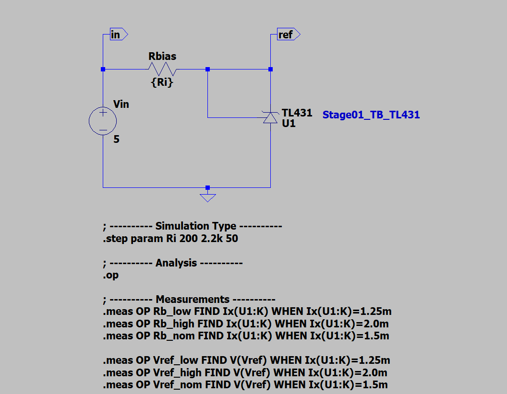
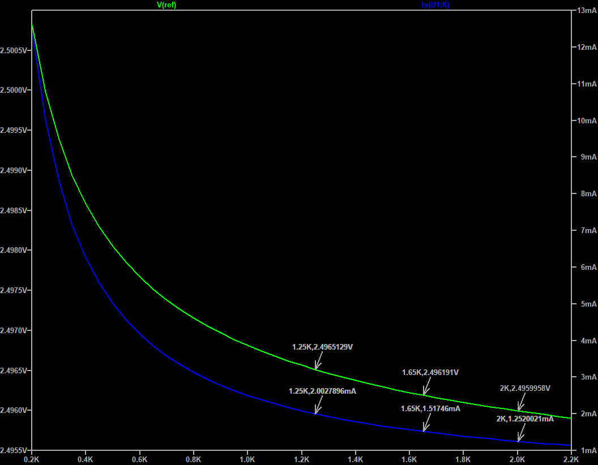
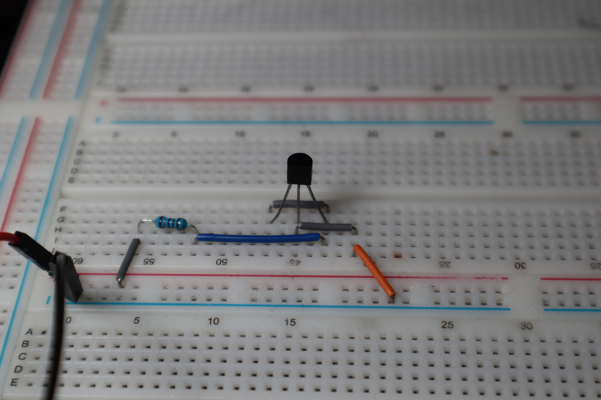

# TL431 Shunt Voltage Reference - Minimum Cathode Current Test

## Overview
Basic characterization tests for TL431 shunt voltage reference operating at minimum cathode current. This stage determines the lowest stable operating point for use as an op-amp reference voltage input.

## Component Used

- **TL431**: Adjustable precision shunt voltage reference
  -  Part Number: TL431A928
  -  Package: TO-92
  - Datasheet: [TL431 Datasheet](https://www.ti.com/lit/ds/symlink/tl431.pdf)
  -  Manufacturer: Texas Instruments


## Circuit Configuration
- **$V_{in}$**: Input voltage to the divider
- **Cathode**: Connected to Ref, sourcing current through Rbias resistor from 5V supply
- **Anode**: Connected to ground
- **Supply Voltage**: 5V DC



---

## Test Objectives

### Primary Goal: Minimum Cathode Current Operation
Determine the minimum stable cathode current for reliable operation as an op-amp reference voltage source. Target current range: 1.25mA to 2.0mA.

---

## LTspice Simulation: Minimum Current Test

### Simulation Setup

**Circuit Parameters**:

- Supply voltage (Vcc): 5V DC
- Bias resistor (Rbias): Swept parameter
- Analysis type: DC operating point (`.op`)
- Sweep range: 200Ω to 2.2kΩ in 50Ω steps

### SPICE Directives
```spice
; ---------- Simulation Type ----------
.step param Ri 200 2.2k 50

; ---------- Analysis ----------
.op

; ---------- Measurements ----------
.meas OP Rb_low FIND Ix(U1:K) WHEN Ix(U1:K)=1.25m
.meas OP Rb_high FIND Ix(U1:K) WHEN Ix(U1:K)=2.0m
.meas OP Rb_nom FIND Ix(U1:K) WHEN Ix(U1:K)=1.5m

.meas OP Vref_low FIND V(Vref) WHEN Ix(U1:K)=1.25m
.meas OP Vref_high FIND V(Vref) WHEN Ix(U1:K)=2.0m
.meas OP Vref_nom FIND V(Vref) WHEN Ix(U1:K)=1.5m
```

### Target Measurements

| Parameter        | Target I_KA | Expected Rbias | Expected V_ref |
|------------------|-------------|----------------|----------------|
| **Low Current**  | 1.25 mA     | ~2.0 kΩ        | 2.495V - 2.496V |
| **Nominal**      | 1.5 mA      | ~1.67 kΩ       | 2.495V - 2.496V |
| **High Current** | 2.0 mA      | ~1.25 kΩ       | 2.496V - 2.497V |

### Simulation Results



| Rbias (Ω) | I_KA (mA) | V_ref (V) | Power (µW) | Notes           |
|-----------|-----------|-----------|------------|-----------------|
| ~2003     | 1.25      | 2.495     | 12.5       | **Recommended** |
| ~1669     | 1.5       | 2.496     | 9.5        | Acceptable      |
| ~1251     | 2.0       | 2.496     | 10.4       | Good margin     |

```
rb_low: Ix(U1:K)=0.00125 at 2003.27941176
rb_nom: Ix(U1:K)=0.0015 at 1669.56845981
rb_high: Ix(U1:K)=0.002 at 1251.81162083
ref_low: V(ref)=2.49599421186 at 2003.27941176
ref_nom: V(ref)=2.4961787079 at 1669.56845981
ref_high: V(ref)=2.49651112761 at 1251.81162083
```

---

## Benchtop Test



- Rbias selection: 1.8 kΩ (E24), 1% recommended
- Expected at VCC = 5.00 V:
- Vref ≈ 2.496 V
- I_KA ≈ (5.00 − 2.496) / 1.8k ≈ 1.39 mA
- TL431 dissipation ≈ 2.496 V × 1.39 mA ≈ 3.5 mW

**Procedure:**

1. Install Rbias = 1.8 kΩ and power at VCC = 5.00 V.
2. Measure Vref at the cathode; expect 2.495–2.497 V.
3. Compute I_KA = (VCC − Vref) / Rbias; expect ≈ 1.39 mA.
4. Sweep VCC from 4.75 V to 5.25 V and confirm regulation.

**Acceptance:**

- At 5.00 V: Vref in 2.495–2.497 V and I_KA ≈ 1.39 mA.
- Across VCC = 4.75–5.25 V: I_KA ≥ 1.25 mA and Vref remains within the regulation band.

**Notes:**

- Worst case check: Vin = 4.75 V and Rbias = +1% → I_KA ≈ 2.254 V / 1.818 kΩ ≈ 1.24 mA (near limit). If additional margin is required, consider 1.74 kΩ or 1.69 kΩ.
- Keep wiring short and decouple Vin locally to minimize measurement noise.

### Measured Results
| Parameter  | Expected Value      | Measured Value      | Percent Error | Notes                         |
|------------|---------------------|---------------------|----------------|------------------------------|
| $Rbias$    | 1.8 kΩ              | 1.786 kΩ ± 1%       | 0.78           | Standard E24 value           |
| $Vref $    | 2.496 V             | 2.492 V             | 0.16           | Within expected range        |
| $I_{KA} $  | 1.39 mA             | 1.36 mA             | 2.16           | Within expected range        |
| $P_{res}$  | 3.5 mW              | 3.3 mW              | 5.71           | Within expected range        |
| $P_{ref}$  | 3.5 mW              | 3.39 mW             | 5.71           | Within expected range        |


## Design Considerations for Op-Amp Interface

### Op-Amp Input Requirements
- Input bias current: Typically nA to pA (CMOS/JFET op-amps)
- Input impedance: Very high (GΩ range for CMOS)
- Loading effect: Negligible compared to $I_{KA}$

### Recommended Operating Point

- $R_{bias}$ = 1.8kΩ ± 1%
- $I_{KA}$ = 1.36mA
- $V_{ref}$ = 2.496V
- Power = 12.5µW

---

## Notes
- Focus on DC characteristics and minimum stable operating current
<!-- TODO -->
